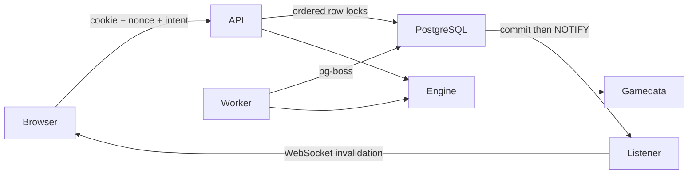
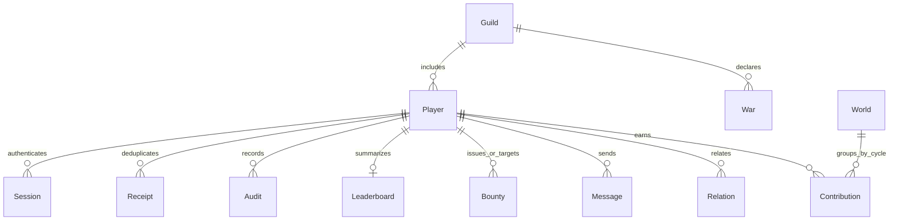
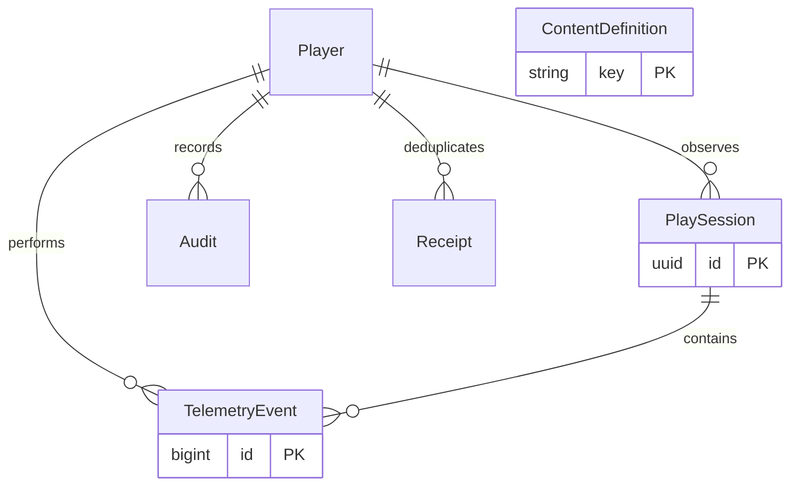
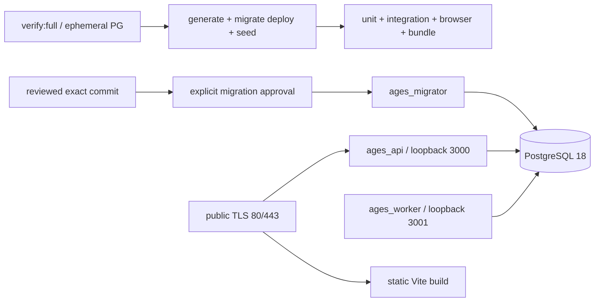

# Architecture

`apps/web` owns presentation, navigation, temporary tab/era selection (Zustand) and server snapshots (TanStack Query). `apps/api` owns authentication, validation, transactions and live fan-out. `apps/worker` owns scheduled catch-up and rankings. `packages/gamedata` owns content and formulas. `packages/engine` is a deterministic reducer given state, server time and a supplied RNG. `packages/database` owns Prisma schema, migrations and seed. `packages/infrastructure` owns bounded LRU, pg-boss, rate limiting and notification adapters.

All game writes acquire actor and target rows in lexical UUID order before reading their state. World actions then lock World. A transaction checks the receipt, computes against locked snapshots, validates the aggregate, saves both sides, records an audit, records the nonce receipt and calls pg_notify inside the transaction. PostgreSQL delivers that event only after commit. Replays return the same stored result and do not repeat rewards. Failed transactions roll back costs as well as rewards.

The JSON aggregate deliberately keeps skill/resource/equipment/mastery changes atomic without dozens of joins. It has a literal schema version and runtime Zod validation. Social/world data and high-traffic expiry tables are relational. Future schema changes must migrate every stored aggregate or add an explicit compatibility decoder; changing a TS type alone is unsafe.

The World-to-Contribution cycle relationship is logical, not a foreign key: historical contributions survive world-cycle rotation. Prisma explicitly models social foreign keys and uses matching referential actions; the migrated PostgreSQL 18 database has been checked for schema drift. Preserve SQL nonnegative/check constraints during future migration work.

## PostgreSQL infrastructure

- **CacheStore:** MemoryCache implements bounded LRU (500 entries, five-second TTL). Only derived leaderboard responses are cached. Invalidation loss merely causes a short stale display; authentication and action validation never use cache.
- **QueueDriver:** PostgresQueue wraps pg-boss scheduled jobs. pg-boss leases PostgreSQL jobs using row locking. Worker `clocks-income-leaderboard` runs minutely; `event-session-timers` every five minutes. Duplicate or late executions are safe because game accrual uses persisted timestamps, not job count.
- **PubSub:** a dedicated PostgreSQL LISTEN connection per API process forwards small invalidation events. Publish can occur transactionally. Notifications contain no balances, chat text, tokens or rewards. Reconnect triggers invalidation, and clients also refresh snapshots every 30 seconds.
- **Sessions:** SHA-256 of 256-bit opaque random token stored with indexed expiry. Cookie is httpOnly, SameSite Strict, Secure in production. Register upgrades guests; explicit refresh rotates the token; logout revokes it. Passwords use argon2id (19 MiB, two iterations, parallelism one).
- **Rate limits:** atomic INSERT ON CONFLICT UPDATE RETURNING against indexed expiry buckets. IP, authentication, player action and chat have distinct budgets. Cleanup is worker-driven.
- **Leaderboards:** summary rows indexed by descending score, refreshed by minutely tick. Rank score=floor(attack power+100×level); influence shown separately.

Expected small-world pools: API Prisma 5 + pg pool 3 + listener 1; worker Prisma 5 + pg pool 3 (lazy) + pg-boss 2. Configure PostgreSQL max_connections around 50 initially, and budget 128 MB shared_buffers locally. The developer processes should remain comfortably below 2 GB combined under light load; listed RSS figures in SETUP are estimates.

The design trades specialized-cache throughput for fewer native services and simpler transactional correctness. There is no hard concurrency ceiling: 1,000 idle users differ from 1,000 clicking users. Begin with 100–500 active concurrent players, measure at 50–100 actions/sec, and load-test before 1,000 concurrent players. All-player minutely writes, world-boss row contention, audit growth and per-process WebSocket fan-out are likely first limits. Batch unchanged-player skips, indexed activity windows and audit partitioning precede infrastructure replacement. QueueDriver/PubSub/CacheStore can be replaced by separately deployed adapters without altering reward rules; a distributed cache must never become authoritative.

## REST and live catalog

| Endpoint                                               | Responsibility                                                                                          |
| ------------------------------------------------------ | ------------------------------------------------------------------------------------------------------- |
| POST /api/auth/guest, register, login, refresh, logout | Identity and session lifecycle; registration may upgrade the current guest.                             |
| GET /api/me                                            | Catch up and return own validated player state.                                                         |
| POST /api/action                                       | Strict action enum with UUID nonce, optional content key/target/stance. No reward/time inputs accepted. |
| GET/POST /api/world                                    | Boss snapshot / nonce-protected strike or reward claim.                                                 |
| GET /api/players, leaderboard, bounties, territory     | Public bounded projections.                                                                             |
| GET/POST /api/social                                   | Orders, wars, friend/rival records.                                                                     |
| GET/POST /api/messages                                 | World, own order, or authenticated two-party mail channel.                                              |
| GET /api/health                                        | Database connectivity, suitable for release health checks.                                              |
| WS /live                                               | Authenticated, origin-checked outbound events; no client reward commands.                               |

Events are JSON `{type}` envelopes: `state` invalidates player snapshots, `chat` invalidates authorized message queries, `world` invalidates boss/world and `leaderboard` is reserved for explicit ranking refresh. Private state invalidations are addressed only to that player. Chat sends a generic invalidation to listeners; message content is always fetched through access checks. Slow sockets exceeding the buffer bound skip invalidations and recover from refetch.

## Never-break invariants

The Ember Ledger extension adds `engine/chronicle-schema.ts` (compatible save fields), `chronicle.ts` (offline, ledger, crew, network, faction, cycle), `presentation.ts` (authoritative UI projections), `api/telemetry.ts` (transactional observations), and `web/desk*` presentation. `gamedata/{content,chronicle,balance}.json` is validated before builds/seeds and mirrored into ContentDefinition. Runtime rules use the immutable release package.

`POST /api/feature` accepts strict nonce/action/key/approach/crew intent. Old HTTP job/prestige actions enter the new timed-operation/Ash Cycle paths. Success rolls are committed at start and masked in snapshots. Worker ticks never refresh lastActiveAt; visible arrivals do. Rational holding remainders and resource clock carry preserve exact partial-versus-single catch-up. See RETENTION.md for formulas.

Telemetry records action categories/timing/counts, never chat text or credentials. Thirty-minute gaps create sessions; worker ticks and hidden-tab polling do not create activity. Client `state` invalidates its snapshot, `chat` invalidates messages, and `world` refreshes world/ranking/territory queries. This avoids refetching every query after every operation.

The additive migration and locked seed preserve existing saves. Deployment briefly stops old services before seeding, preventing an old schema parser from erasing new aggregate fields. Code rollback never rolls back schema. Additional invariants: playable forgery/redaction never changes permanent audits; offline reports never grant value on acknowledgement; settlement retries cannot grant XP/loot/telemetry twice; optional media never enters the initial graph or replaces 2D controls.

1. Clients choose intent, never time, RNG, rewards, contribution totals or resulting state.
2. Every game mutation that grants/spends value is behind one durable nonce receipt and an audit in the same transaction.
3. Lock order is player IDs ascending, then world. Never perform network calls inside those transactions.
4. Resources and currency never become negative; supplied state parses against the versioned schema before persistence.
5. A reset never makes an old reward claimable twice; receipts are not deleted by routine cleanup.
6. Notifications are hints; PostgreSQL is the source of truth after every restart, reconnect and cache miss.
7. UTC buckets and elapsed server time govern all clocks, streaks, protection and seasons.
8. Same-origin validation and httpOnly cookies protect mutations; production proxy trust is limited to loopback Caddy.
9. No raw passwords, cookies or connection strings belong in logs or the repository.

// TODO(agent): Add audit/receipt retention partitions, moderation/report tooling and measured load tests before public launch.

## Release foundation — 2026-09-22

`packages/gamedata/src/catalog.ts` is the shared canonical catalog list for seed and readiness. `scripts/database-status.ts` compares checked-in migration hashes, failed/pending history, canonical content, world seed and generated Prisma schema. Doctor reads these without mutation. The disposable acceptance runner uses unique PG credentials/database and an isolated Windows native cluster or an explicitly supplied `VERIFY_ADMIN_URL`; it intentionally ignores the ordinary app DATABASE_URL. Migration SQL and repeat seed preserve existing player aggregates. Every production schema change is an explicit release gate.

The additive `OperationalStatus` table holds per-job last success/failure, duration, lag and failure count. Worker startup and each scheduled job update it; `/api/ready` requires a fresh worker heartbeat. API/worker metrics expose counters without player data. WebSocket connections are drained on shutdown, and pg-boss stops gracefully while in-flight jobs settle or retry. JSON HTTP logs record generated request IDs, route template, method, status and latency, never request body/query, cookie or raw error. Both Caddy and Fastify set security headers; only the exact APP_ORIGIN may mutate state. Production configuration fails closed on non-HTTPS origins, non-loopback bind, weak ops token or admin DB URL variables.

Analytics is disabled unless `ANALYTICS_ENABLED=true` is deliberately set. The operator query requires `--operator` and emits aggregate cohorts only. Session/telemetry observations retain only action category and timing/counts. A 30-day cleanup command defaults to dry-run and requires an explicit deletion flag; permanent audits and reward receipts are excluded. Backup/restore ownership and non-production verification live in RECOVERY.md. The physical trace protocol is DEVICE_VALIDATION.md.

// TODO(agent): Measure hosted queue retries/lag and database pool saturation; tune readiness/alert thresholds from a real load test.

## OCI staging boundary (preparation only)

The proposed first rehearsal keeps Caddy/static assets public on one approved staging VM while API, worker and PostgreSQL 18 bind to loopback. A separate private subnet is reserved, empty. API, worker, backup and release use distinct Unix users and env files; PostgreSQL roles remain separately scoped. Staging intake, fixed read-only OCI preflight/plan, NSG/security-list/host-firewall intent, DNS/TLS, encrypted off-host backup with independent key custody, and RACI gates are in [OCI_STAGING_ARCHITECTURE.md](OCI_STAGING_ARCHITECTURE.md) and [OCI_STAGING_RUNBOOK.md](OCI_STAGING_RUNBOOK.md). OCI resources and physical performance have not been exercised. No runtime process migrates; release still requires exact SHA and explicit migration approval.
